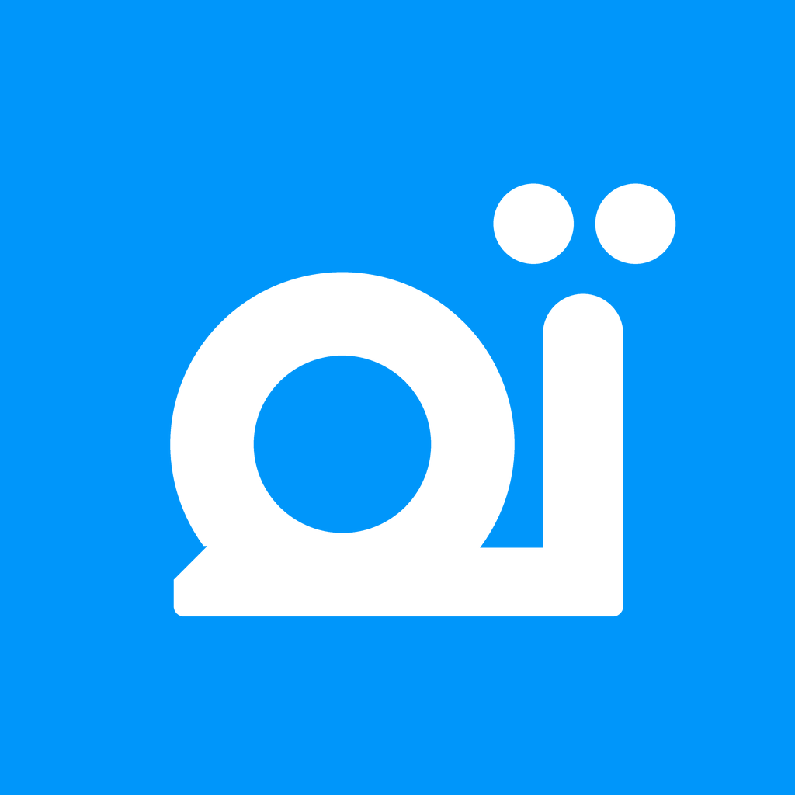
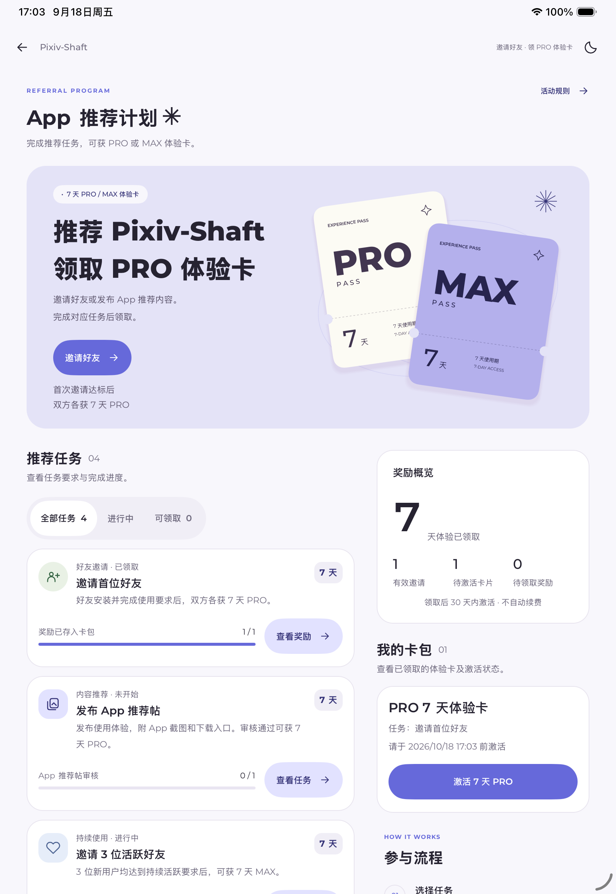
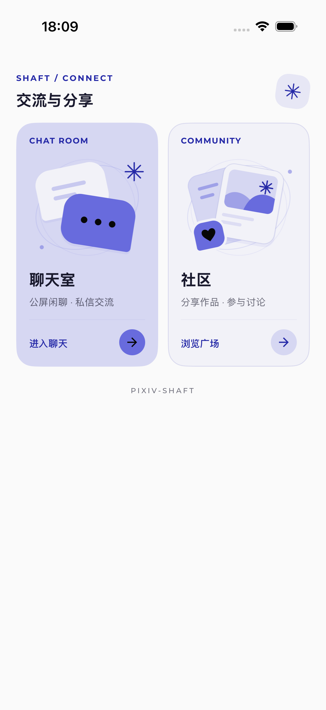
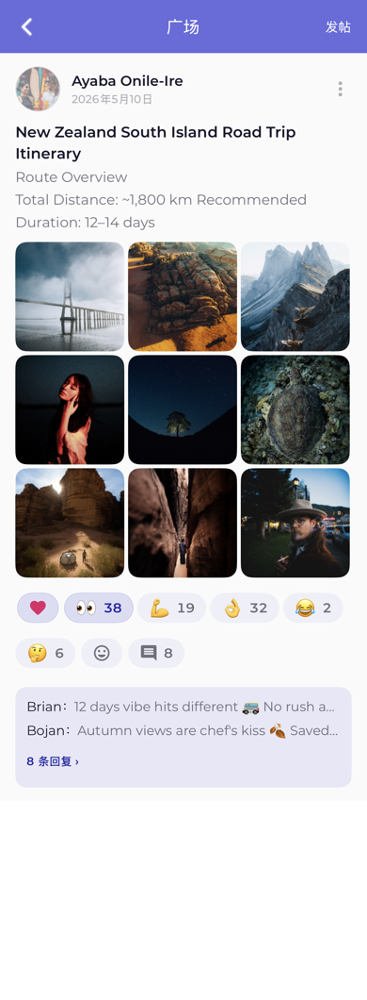
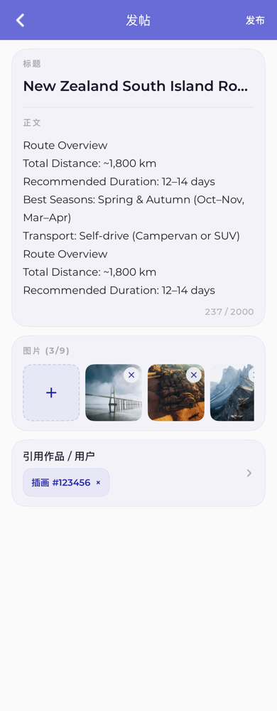
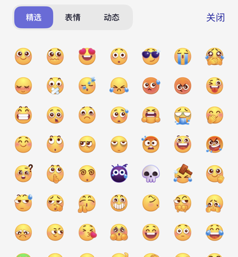

<div align="center">

<picture>
  <source media="(prefers-color-scheme: dark)" srcset="Shaft-iOS/Assets.xcassets/AppIcon.appiconset/AppIcon-Dark.png">
  
</picture>

# Shaft for iOS

**[Pixiv-Shaft](https://github.com/CeuiLiSA/Pixiv-Shaft) 的原生 iOS / iPadOS 版本**<br>
插画、漫画、小说、榜单、本地收藏库，用 SwiftUI 一比一移植

<br>

[](#构建)
[](#技术栈)
[](#平板)

[](https://github.com/CeuiLiSA/Shaft-iOS/commits/main)
[](https://github.com/CeuiLiSA/Shaft-iOS)


<sub>简体中文 · 繁體中文 · English · 日本語 · 한국어 · Русский · Türkçe</sub>

</div>

> [!NOTE]
> 本项目是 [Pixiv](https://www.pixiv.net) 的非官方第三方客户端，与 pixiv Inc. 无关。站内插画、漫画与小说的版权归各自作者或 Pixiv 所有。

<br>

<table>
<tr>
<td width="58%" valign="top"></td>
<td width="42%" valign="top"></td>
</tr>
</table>

<table>
<tr>
<td></td>
<td></td>
<td></td>
<td></td>
</tr>
</table>

## 功能

<table>
<tr>
<td width="50%" valign="top">

#### 🎯 浏览与发现
推荐流（插画 / 漫画 / 小说）、今日榜单、热门标签，发现页的各类榜单与标签货架，以及原生版的「官网发现」（全部 / 全年龄 / R-18）。

#### 🔍 搜索
多种排序与筛选，搜索历史，一键置顶标签组合。没有 Premium 的账号可以借用会话按热度排序。

#### 🖼️ 作品详情与看图
多页作品可以折叠或展开，动图直接播放，全屏看图自动加载原图并支持双指缩放；作品卡片菜单和「稍后再看」可以开幻灯片播放。标签原文的亮度可以单独调。

#### 📥 下载
按「默认图片清晰度」存入相册。动图导出为 GIF。批量队列可暂停、继续，剩余空间不足时整体暂停并提示。

</td>
<td width="50%" valign="top">

#### 📚 本地收藏库
插画、小说收藏和关注都镜像到本地 SQLite：倒序、按标签 / 作者 / 年份筛选、多关键词检索（纯数字可直接查作品或画师 ID）。首次同步期间就能进库浏览。

#### 📖 小说与漫画阅读器
翻页 / 滚动两种模式，7 套配色，每套配色的字色独立记忆，可跟随系统暗色，单手翻页。**朗读**支持高亮跟读、自动翻页、锁屏控制。漫画支持翻页和条漫两种模式。

#### 💬 交流
聊天室（公屏 / 私信）、广场（发帖、评论、表情与贴纸回应、九宫格图片直传），以及共享贴纸系统。

#### 🛡️ 其他
屏蔽标签 / 画师 / 作品，稍后再看，浏览历史，App 推荐计划，图片代理，七种界面语言，深浅主题。

</td>
</tr>
</table>

### 平板

窗口宽度 ≥ 600pt 时切换到平板排版。分屏或台前调度把窗口缩窄后，会自动回到手机排版。

- **侧边导航栏**：88pt 宽，取代底部标签栏，并提供「收藏 / 下载」快捷入口。
- **自适应瀑布流**：保持卡片的物理尺寸，按内容宽度增加列数。
- **作品舞台**：横屏时作品固定在左侧，右侧信息栏单独滚动；竖屏时上下排布；背景使用作品的模糊色。

## 与 Android 版的关系

Shaft for iOS 跟随 [Pixiv-Shaft](https://github.com/CeuiLiSA/Pixiv-Shaft) 的功能演进，逐个功能**像素级移植**：

- 以 Android 当前源码为基准：dp → pt、sp → 默认字号下的 pt，对齐布局数值、字重、行高与动效时长。
- 复用 Montserrat 400–800 真实字重与原始矢量路径，中文走系统字体回退。
- 七种语言的文案直接从 Android `values-*` 同步，不另写翻译。
- 源码里的注释标注了对应的上游类与 issue 编号（如 `#1087`、`pixez#1361`），方便对照。
- 仅 Android 才有的能力（预测性返回、抽屉、Glide / WebView 相关修复等）不移植；iOS 没有对应能力的功能会注明跳过原因。

各模块的移植基准、尺寸对照和验收截图见 [专题文档](#专题文档)。

## 构建

**环境**：Xcode 27（最低部署目标 iOS 18.0）。没有第三方依赖，不需要 SPM / CocoaPods。

```sh
git clone https://github.com/CeuiLiSA/Shaft-iOS.git
cd Shaft-iOS
open Shaft-iOS.xcodeproj    # 选择 Shaft-iOS scheme，运行到模拟器或真机
```

语言引导页的背景动画用到 Metal 着色器。如果首次编译报缺少 Metal 工具链，执行：

```sh
xcodebuild -downloadComponent MetalToolchain
```

命令行编译与单元测试：

```sh
xcodebuild -project Shaft-iOS.xcodeproj -scheme Shaft-iOS \
  -destination 'platform=iOS Simulator,name=iPhone 17 Pro' build

xcodebuild test -project Shaft-iOS.xcodeproj -scheme Shaft-iOS \
  -destination 'platform=iOS Simulator,name=iPhone 17 Pro' \
  -only-testing:Shaft-iOSTests
```

真机运行需要在 *Signing & Capabilities* 里换成自己的 Team 和 Bundle Identifier。

## 技术栈

| | |
|---|---|
| UI | SwiftUI 为主；小说阅读器排版用 UIKit + TextKit 1 |
| 状态 | Observation（`@Observable`、`@MainActor`） |
| 本地库 | SQLite actor（收藏 / 关注镜像，keyset 分页） |
| 网络 | URLSession，Pixiv OAuth 2.0 (PKCE)，Keychain 存令牌 |
| 媒体 | AVSpeechSynthesizer 朗读、Now Playing / 远程控制，Photos 保存，动图 GIF 编码 |
| 本地化 | 自有 `LocalizedKey` + `LocalizedStrings`，运行时可切换语言 |

## 项目结构

```
Shaft-iOS/
├── Home/  Recommend/  Discover/  Ranking/  WhatsNew/   首页各 tab、榜单、发现页
├── Detail/                                            作品 / 小说 / 用户详情，看图，平板作品舞台
├── Search/  Prime/                                    搜索、置顶标签、热度标签
├── BookmarkLibrary/                                   本地收藏库与关注库（SQLite 镜像）
├── NovelReader/  ComicReader/  Slideshow/             阅读器、朗读、幻灯片
├── Download/  History/  WatchLater/  Mute/            下载队列、历史、稍后再看、屏蔽
├── Chat/  Plaza/  Sticker/  Referral/                 聊天室、广场、贴纸、推荐计划
├── PixivAPI/  PixivOAuth/  Routing/                   接口、登录、路由
├── Onboarding/  Localization/  More/  Common/         引导、七语言文案、设置、通用组件
Shaft-iOSTests/                                        单元测试与渲染测试
docs/                                                  各模块的移植说明与验收截图
scripts/                                               资源 / 文案同步与工程文件注册脚本
```

## 开发约定

- **新文件要注册进工程**：工程文件由人工维护，新增的 Swift 文件需要登记到 `project.pbxproj`，可参考 `scripts/register-*.py`。
- **文案**：在 `LocalizedKey` 加 case，并在 `LocalizedStrings` 七种语言里都补上；优先从 Android 资源同步（参考 `scripts/sync-*-strings.py`）。
- **视觉**：以 Android V3 设计规范为准。验收要覆盖深浅主题、320pt 窄屏、长文案和系统大字体，触控区域不小于 44pt。
- **提交信息**：`feat(scope): 中文描述`，与上游保持一致。

## 专题文档

| 模块 | 说明 |
|---|---|
| [发现页 · 交流与分享](docs/discover-social/README.md) | 入口卡片的布局断点、插图复现、配色推导 |
| [广场](docs/plaza/README.md) | 发帖、图片直传、回应，与 Android 渲染基准的逐项对照 |
| [贴纸系统](docs/stickers/README.md) | 共享贴纸仓库、选择器尺寸、聊天与广场两条链路 |
| [App 推荐计划](docs/referral/README.md) | 页面结构、弹窗、服务端状态与验证边界 |

<br>

<div align="center">
<sub>Android 版 → <a href="https://github.com/CeuiLiSA/Pixiv-Shaft">CeuiLiSA/Pixiv-Shaft</a> · 官网 → <a href="https://pixshaft.com">pixshaft.com</a></sub>
</div>
