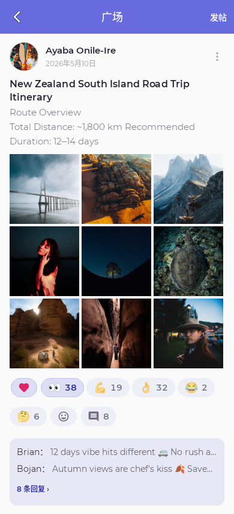

# iOS 广场移植

从 Android `ceui.pixiv.plaza` 移植到 SwiftUI/UIKit。入口沿用发现页「交流与分享 → 广场」及 `AppRoute.plaza`，路由目标为 `PlazaView()`。

## 功能

- 全部 / 我的、游标分页、下拉刷新、帖子详情、评论与回复、点赞、表情 / 贴纸回应。
- 标题、正文、最多 9 张图片、插画 / 漫画 / 小说 / 用户引用，发帖与评论共用服务端帖子接口。
- 系统相册多选、真实格式与尺寸校验、上传进度、COS 直传、失败重试、按账号保存草稿和未完成的上传票据。
- 删除自己的帖子、举报帖子 / 作者（最多 3 张证据图片）、屏蔽 / 解除屏蔽、社区规则确认。
- 七种语言，深浅主题，字体放大、减少动态效果、手机与平板布局。

## 视觉基准

按 Android 当前布局数值将 dp/sp 映射为默认字号下的 iOS point，复用原始矢量路径、空态图片、返回图标、Montserrat 400–800 字体与七语言文案。中文使用系统字体回退。局部 `PlazaPalette` 使用 Android 默认主题 `#686BDD`，不改写 iOS 全局主题。

| 元素 | 对齐数值 |
| --- | --- |
| 工具栏 | 56 高，标题 18；分段项最小 88×36 |
| 列表 | 横向 16、纵向 14；头像 48、间距 12 |
| 标题 / 正文 | 列表 16/22.4、15/24；详情 24/31.2、16/27.2 |
| 九宫格 | 间隔 4；格子宽度向下取整；单图圆角 16、多图 12 |
| 回应 | 可见胶囊 32、触控区域 48；横向间隔 4，无额外行距 |
| 发帖 | 内容横向 16、顶部 12；卡片圆角 22，内边距 16×14 |
| 图片选择 | 80×80 缩略图、间距 8、圆角 12；删除圆片 22、触控区域 40 |
| 平板 | 内容最大宽度 720，居中 |

截图在 [screenshots](screenshots/)；Android 当前代码的渲染测试基准在 [android-reference](android-reference/)。列表使用同一组 Android 测试照片与文字。

| Android 列表基准 | iOS 同内容渲染 |
| --- | --- |
|  |  |

[iOS 完整列表](screenshots/timeline-390-light.png) · [深色详情](screenshots/detail-390-dark.png) · [发帖含照片](screenshots/compose-filled-390-light.png) · [320 宽大字号](screenshots/compose-320-large-dark.png)

这些截图用于逐项视觉核对，**没有把跨平台整屏像素差为零作为已通过结论**：系统中文字体与 emoji、状态栏、键盘、相册选择器仍由 iOS 绘制。Android 离屏 `Canvas` 截图不能完整呈现 `clipToOutline`，基准中的方形图片在真实页面上有圆角；iOS 按源代码保留圆角。Android 发帖截图使用粉色主题，iOS 对照使用默认紫色主题。

## 网络与状态

广场和 media API 都使用 Tokyo `https://api.pixshaft.com`。`PlazaSession` 基于现有 Referral 会话实现，但使用独立 Keychain service、device ID、Token 缓存和刷新任务。Pixiv OAuth 与主站会话不会发送给 Tokyo 或 COS。

1. `/v1/auth/session` 对实际发送的 JSON 字节计算 HMAC。
2. `/v1/auth/token` 刷新前持久化幂等 ID，网络错误后重试继续使用该 ID；仅明确失效时重新建立会话。
3. API 401 最多刷新重试一次；读写响应返回后重新核对账号。
4. 上传先 `upload/init`，按照返回 URL 和 headers 直接 PUT 原始图片字节，再 `upload/complete`。服务端返回尺寸必须与本地元数据一致。
5. 上传重试先检查旧票据是否已完成，保留已完成的 media ID。发帖失败保留 requestId，正文、标题或附件编辑后才生成新 ID。
6. 列表读取不能覆盖更新后的点赞 / 删除状态；签名图片 URL 到期时重新获取帖子。图片查看器重试也会刷新签名。

贴纸沿用主站 `/f/v1/stickers` 元数据与 COS ZIP，验证大小和 SHA-256；64 位 ID 按字符串传给广场接口，不经浮点数转换。

## 验证与复现

2026-09-18 在原目录完成最终验证：iPhone 17 Pro / iOS Simulator 26.5，**26/26 通过、0 失败、0 跳过**（20 项逻辑测试、1 项渲染测试、5 项入口与草稿 UI 测试）。最终结果包保留于 `/tmp/shaft-plaza-integrated-20260918.xcresult`。本目录保存 14 张渲染截图及 [实际草稿输入截图](screenshots/plaza-draft-interaction.png)。`git diff --check` 通过。

```sh
xcodebuild -project Shaft-iOS.xcodeproj -scheme Shaft-iOS \
  -destination 'platform=iOS Simulator,name=Shaft Plaza Validation' \
  -derivedDataPath /tmp/shaft-plaza-validation \
  -resultBundlePath /tmp/shaft-plaza-validation.xcresult \
  -only-testing:Shaft-iOSTests/PlazaTests \
  -only-testing:Shaft-iOSTests/PlazaRenderTests \
  -only-testing:Shaft-iOSUITests/PlazaUITests \
  -only-testing:Shaft-iOSUITests/DiscoverSocialUITests \
  -parallel-testing-enabled NO \
  CODE_SIGNING_ALLOWED=NO test
```

`PlazaTests` 覆盖 HMAC、并发刷新、跨重启刷新重试、401 重放、账号切换、列表与写入并发、删除墓碑、发帖幂等、草稿恢复、已上传对象复用、原始图片字节及真实格式、Unicode 字符上限与语言资源。`PlazaRenderTests` 使用本地 URLProtocol 图片和假服务生成截图，不依赖线上登录，也不发送线上帖子。

```sh
python3 scripts/sync-plaza-strings.py /path/to/Pixiv-Shaft
# 在安装了 fonttools 的 Python 环境中执行：
python3 scripts/sync-plaza-icons.py /path/to/Pixiv-Shaft
```

Android 对照图来自 `PlazaFigmaRenderTest` 与 `PlazaComposeRenderTest`。iOS 截图包括列表 / 详情深浅色，320/390/768 宽发帖，已填写标题正文与照片、评论、字体放大和空态 / 错误态。截图是视觉审核产物，不是自动逐像素断言；模拟接口测试不能替代真实账号的线上发帖验收。

## 与另一 session 协作

实现先在独立副本 `Shaft-iOS-plaza-port-20260918` 进行，继承原目录未提交代码，并在接入前重新同步另一 session 的最新 Referral 和 DiscoverSocial 工作。

最终新增 `Plaza/`、测试、资源同步脚本与本文档；共用代码只新增 Xcode 构建条目，以及将 `.plaza` 的 `PlazaEntryPendingView()` 替换为 `PlazaView()`。`DiscoverSocialUITests` 中原先检查广场占位文字的断言相应改为检查真实广场入口；聊天和布局测试保持原逻辑。不替换发现页、设置、App、Referral 或另一 session 的社交组件，不改变原仓库分支与暂存区。


## Launch review（2026-09-18）

标的是本会话的 `f867eb5`，不审查或提交另一 session 正在做的 Chat / Sticker / 工程注册改动。同一广场文件中的贴纸接入改动按代码段保留。

本轮修复：

- 列表和评论底部进度控件持续显示时，分页任务原先只执行一次。改为随下一页游标重新启动；实测原实现列表停在第二页、评论停在第一页，修复后连续三页加载通过。
- 两次刷新乱序返回时，旧请求虽不能更新页面 ID，却能覆盖共用的帖子缓存。现在写入缓存前同时检查页面请求代次；回归测试确认新点赞数不会被旧响应覆盖。
- COS 图片签名有效期为 5 分钟，重新显示旧列表图片和点击图片重试时刷新帖子签名，避免反复访问过期 URL。
- 引用作品缩略图改为复用已有 `Illust` 导航目的地，保留作品详情中的作者 / 相关推荐等后续路由。
- 原始 JPEG 的 EXIF 方向在全屏查看器中得到保留：在分块缩放视图外校正旋转与镜像，不重编码上传文件，也不修改共享的 Pixiv 图片查看器。使用四角色块对照 UIKit 标准解码，8 种 EXIF 方向全部通过。

验证：原目录编译与 **31/31 测试通过，0 失败、0 跳过、无运行时警告**（21 项逻辑、5 项渲染 / 视图回归、5 项发现入口 / 草稿 UI 测试）。结果包：`/tmp/shaft-plaza-review-final-20260918.xcresult`。另检查工程资源引用、七语言资源完整性、同步脚本语法与差异空白。

仍未用真实账号发帖或向线上 COS 上传；线上端到端验收范围不变。新增导航接线经过代码路径核对和编译，现有 UI 回归覆盖发现入口与返回，不宣称覆盖了引用作品内的所有跳转。
